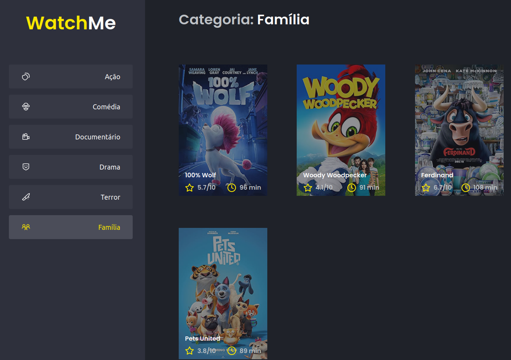

<h1 align="center">
  
</h1>

<h4 align="center">
  🚀 [Ignite] Desafio 02 - Trilha ReactJS
</h4>

## 💻 Projeto

Projeto desenvolvido durante o programa de aceleração profissional **Ignite**, oferecido pela [Rocketseat][rocketseat].
A ideia do desafio é refatorar uma página para listagem de filmes de acordo com gênero, com os seguintes requisitos:

- A aplicação possui apenas uma funcionalidade principal que é a listagem de filmes;
- Na sidebar é possível selecionar qual categoria de filmes deve ser listada;
- A primeira categoria da lista (que é "Ação") já deve começar como marcada;
- O header da aplicação possui apenas o nome da categoria selecionada que deve mudar dinamicamente.

## 🛠 Tecnologias

As seguintes tecnologias foram utilizadas no desenvolvimento do projeto:

- [Babel][babel]
- [React][reactjs]
- [Sass][sass]
- [TypeScript][typescript]
- [Webpack][webpack]

## 📷 Screenshots

<kbd>
  
</kbd>

[babel]: https://babeljs.io/
[reactjs]: https://reactjs.org/
[rocketseat]: https://rocketseat.com.br/
[sass]: https://sass-lang.com/
[typescript]: https://www.typescriptlang.org/
[webpack]: https://webpack.js.org/
